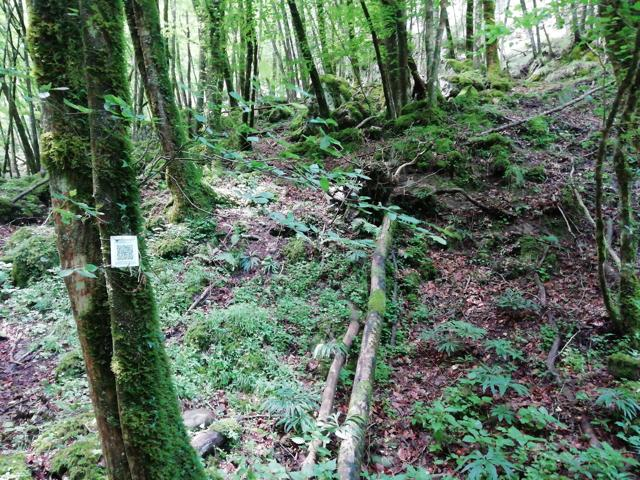
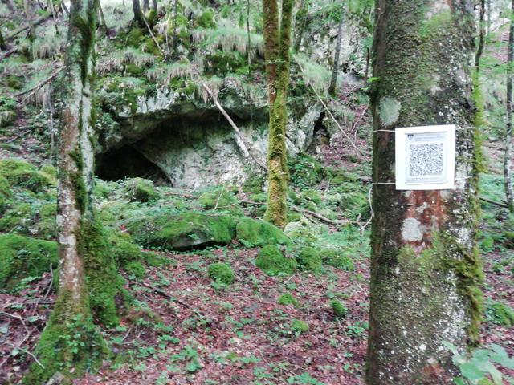
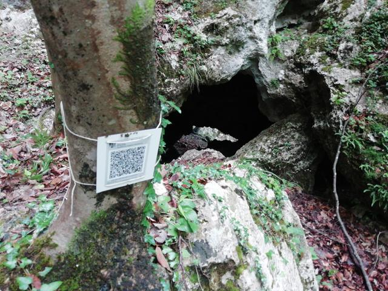
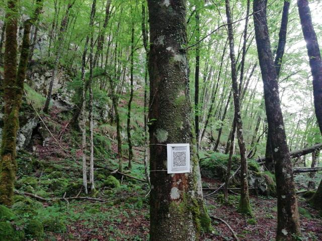

# esempioqrtag
## Percorso: Seconda ricognizione Piella
*Nessuna immagine* 

**Dalla strada alla Piella e ritorno con i nuovi QR code**
## POI: Deviazione piella
 

**Deviazione dal greto del torrente verso la Piella**
## QRtag: Riparo 2
 

**Riparo sottoroccia**
## POI: Ingresso Piella
 

**Ingresso del passaggio per accedere alla Piella**
## POI: Riparo sottoroccia lungo percorso Piella
 

**Riparo sottoroccia**
## Percorso: Seconda ricognizione Piella
*Nessuna immagine* 

**Dalla strada alla Piella e ritorno con i nuovi QR code**
## POI: Deviazione piella
 

**Deviazione dal greto del torrente verso la Piella**
## POI: Riparo 2
 

**Riparo sottoroccia**
## POI: Ingresso Piella
 

**Ingresso del passaggio per accedere alla Piella**
## POI: Riparo sottoroccia lungo percorso Piella
 

**Riparo sottoroccia**
